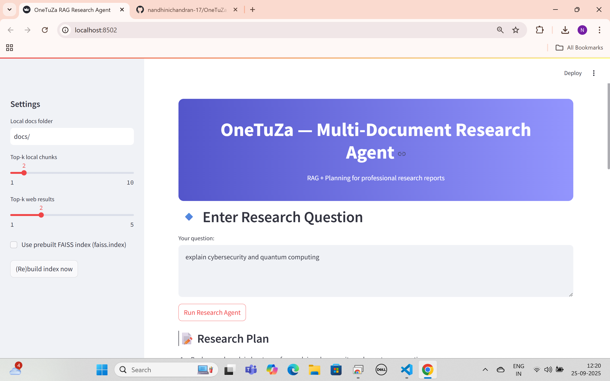
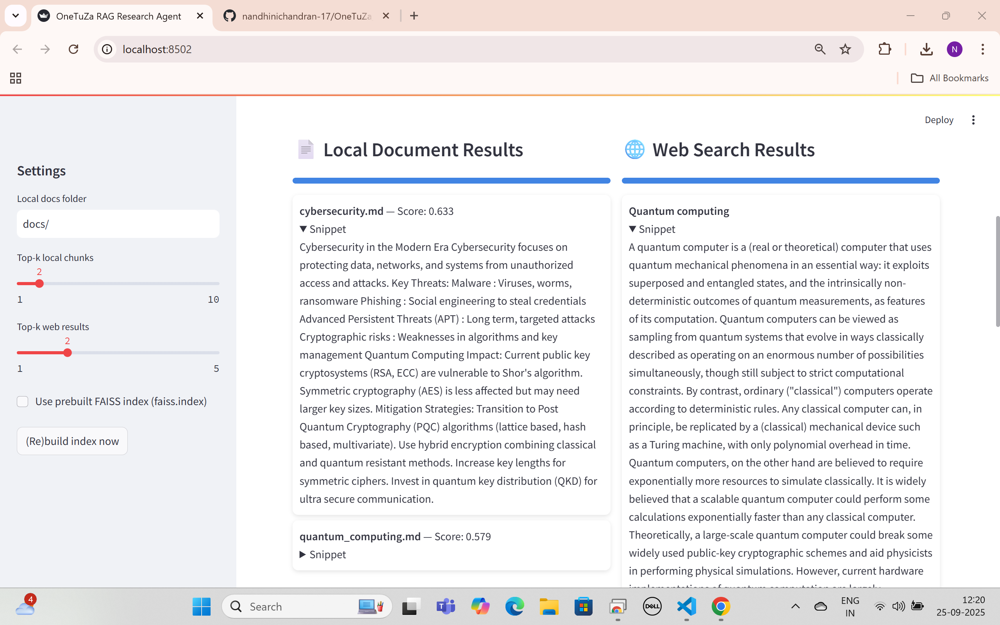

# OneTuZa — Multi-Document Research Agent (RAG + Planning)

## Summary
This project implements a Research Assistant that:
- Accepts a natural language question.
- Searches local PDF/Markdown documents and the web (Wikipedia, optional SerpAPI).
- Retrieves top-k relevant chunks using dense-vector retrieval (FAISS + SentenceTransformers).
- Synthesizes a structured Markdown report with inline citations and traceability.
- Implements a planner → retriever → synthesizer multi-step pipeline.

## Repo structure
one-tuza-rag/
├─ README.md
├─ ingest.py
├─ vectorstore.py
├─ web_search.py
├─ planner.py
├─ synthesizer.py
├─ app.py
├─ docs/

## Quick start

1.Clone:
```bash
git clone <your_repo_url>
cd one-tuza-rag

2.Create .env from .env.example and add keys if using OpenAI/SerpAPI.

3.Install:
pip install -r requirements.txt

4.Add local docs (PDF/MD/TXT) to docs/.

5.Run:
 streamlit run app.py
 
6.	In the UI:
	•	click “(Re)build index now”
	•	enter question
	•	run research agent
	•	export final JSON report if desired

Notes & configuration
	•	By default the project uses SentenceTransformers (all-MiniLM-L6-v2) for embeddings (no external key).
	•	Set OPENAI_API_KEY to use OpenAI to produce higher-quality summarizations (see .env.example).
	•	Optionally set SERPAPI_API_KEY to use SerpAPI for broader web results. If not set, the app falls back to Wikipedia.


## 📸 Screenshots

### Home Page


### Search-results Output


### Final-report and traceability

